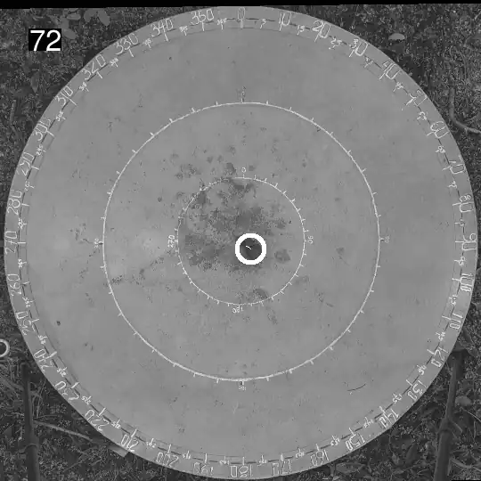
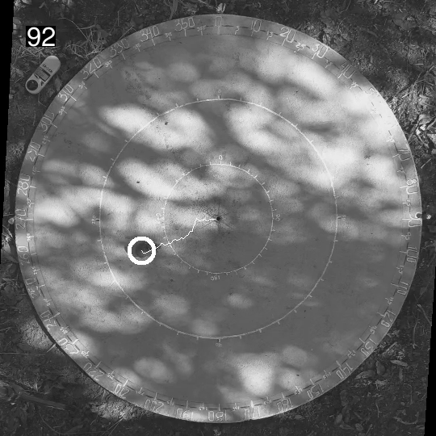

# Your results

When `main` finishes, you have two kinds of output: **files on disk** (in a `results_dir` folder, created in the folder Julia was started in) and, if you're working in Julia, a **DataFrame** returned by `main`. Most people only need the files.

## The track files

Each run's track is written to `results_dir/<run_id>.csv` — a plain csv you can open in Excel, R, Python, MATLAB, or anything else. It has three columns:

| column | content |
| --- | --- |
| `time` | the timestamp, in seconds into the video, of each detected coordinate. |
| `x`, `y` | the target's **real-world** coordinates at that time. |

The coordinates are already fully converted — lens distortion, perspective, and scale are all corrected:

- The **origin** (0, 0) is at the calibration's `center` (if you gave one).
- If you gave a `north` point, the coordinates are rotated so north is consistent across calibrations.
- The **unit** is whatever your calibration used: the `checker_size` unit for checkerboard and AprilTag calibrations (e.g. cm if you measured your squares in cm), the `scale` unit for `only_scale`, or the MATLAB calibration's unit for `matlab`.
- `x` grows rightward and `y` grows **downward** in the image, like the pixel convention.

## The diagnostic video

`main` also writes `results_dir/diagnostic.mp4`: every run rendered top-down through its calibration into a fixed 540×540 canvas, with a circle around the tracked position, a trailing trace, and the video's file name as a label — one run after the other, playing at 2× real time (≈24 fps regardless of the tracking fps).

This is what a healthy run looks like — the circle sits on the animal for the whole run, and the trace grows behind it from the centre of the arena to the edge (one complete run, looping):



And the same check works in harder conditions. Here the arena is covered in dappled light, yet the circle should still follow the animal — if it jumps to a bright patch instead, you've caught a bad track:



!!! danger "Watch it!"
    The diagnostic video is the fastest way to catch a tracker that latched onto a shadow, a wrong starting position, or a bad calibration. Watch it before analysing any tracks.

Things to look for:

- The circle should stay on your animal for the whole run — not jump to a shadow, a droppings mark, or a cable.
- The arena should look right in the top-down view: straight edges straight, circles circular. A warped arena means a bad calibration.
- The trace should look like a plausible path for your animal.

## Working with the results in Julia

`main` returns a `DataFrame` with one row per run:

| column | content |
| --- | --- |
| `run_id`, `calibration_id` | the identifiers from the csv files. |
| `run` | the track: a tuple `(ts, coords)` of timestamps (seconds into the video) and the target's **real-world** coordinates — the same data as the track file. |
| `rectification` | the calibration: a named tuple whose `image2real` function converts pixel coordinates to real-world coordinates; `real2image` is its inverse. |
| `r`, `c` | the parsed run and calibration entries (all the resolved parameter values). |

For example:

```julia
runs = main("path/to/data")
ts, xy = runs.run[1]    # first run: timestamps + real-world coordinates (e.g. cm)
```
